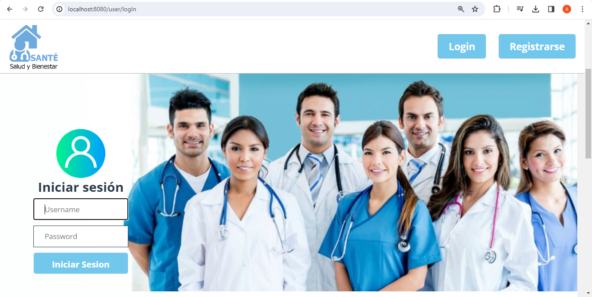

# Santé

This web app allows a homecare company to manage information relative to its care services, as well as gives remote access to clinical reports (they are permanently updated by medical staff) to patients and relatives.

## Table of Contents

1. [Development Team](#development-team)
2. [Tech Stack](#tech-stack)
3. [Database](#)
4. [Mockups](#)
5. [Instruciones para correr el projecto localmente](#)
6. [Comando para servir el app](#)

## Development Team

- Laura Barreto
- Laura Olivares
- Aida Mina
- Johanna Mora F

## Tech Stack

- Data Layer
  - PostgreSQL
  - Heroku
  - TablePlus
  - Django
  - VueJS

# Take a look to the Home Page

